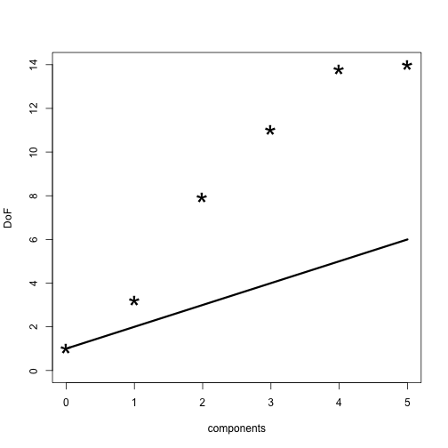

<!-- README.md is generated from README.Rmd. Please edit that file -->


# plsdof 

# Degrees of Freedom and Statistical Inference for Partial Least Squares Regression
## Maintainer: Frédéric Bertrand

<!-- badges: start -->
[](https://lifecycle.r-lib.org/articles/stages.html)
[](https://www.repostatus.org/#active)
[](https://github.com/fbertran/plsdof/actions)
[](https://app.codecov.io/gh/fbertran/plsdof?branch=master)
[](https://cran.r-project.org/package=plsdof)
[](https://cran.r-project.org/package=plsdof)
[](https://github.com/fbertran/plsdof)
[](https://zenodo.org/badge/latestdoi/167805443)
<!-- badges: end -->


The plsdof package provides Degrees of Freedom estimates
        for Partial Least Squares (PLS) Regression. Model selection for
        PLS is based on various information criteria (aic, bic, gmdl)
        or on cross-validation. Estimates for the mean and covariance
        of the PLS regression coefficients are available. They allow
        the construction of approximate confidence intervals and the
        application of test procedures.
        Further, cross-validation procedures for Ridge Regression and 
        Principal Components Regression are available.


The plsdof package was fully coded and developped by Nicole Kraemer and Mikio L. Braun. It is mainly based on the article by N. Kraemer, M. Sugiyama (2012): "The Degrees of Freedom of Partial Least Squares Regression", *Journal of the American Statistical Association*, **106**(494):697-705, [doi:10.1198/jasa.2011.tm10107](https://dx.doi.org/doi:10.1198/jasa.2011.tm10107).


Yet due to the regular updates in CRAN policies, it was removed from the CRAN and orphaned since the former maintainer had stopped updating the package. The plsdof package is required by several packages of Frédéric Bertrand who was then selected as the new maintainer since late 2018. 

This website and these examples were created by F. Bertrand.


## Installation

You can install the released version of plsdof from [CRAN](https://CRAN.R-project.org) with:


```r
install.packages("plsdof")
```

You can install the development version of plsdof from [github](https://github.com) with:


```r
devtools::install_github("fbertran/plsdof")
```

## Example

### PLS model example.

The pls.model function computes the Partial Least Squares fit.


```r
n<-50 # number of observations
p<-15 # number of variables
X<-matrix(rnorm(n*p),ncol=p)
y<-rnorm(n)

ntest<-200 #
Xtest<-matrix(rnorm(ntest*p),ncol=p) # test data
ytest<-rnorm(ntest) # test data

library(plsdof)
#> Le chargement a nécessité le package : MASS
# compute PLS + degrees of freedom + prediction on Xtest
first.object<-pls.model(X,y,compute.DoF=TRUE,Xtest=Xtest,ytest=NULL)

# compute PLS + test error
second.object=pls.model(X,y,m=10,Xtest=Xtest,ytest=ytest)
```

### Model selection for Partial Least Squares based on information criteria

The pls.ic function computes the optimal model parameters using one of three different model selection criteria (aic, bic, gmdl) and based on two different Degrees of Freedom estimates for PLS.


```r
n<-50 # number of observations
p<-5 # number of variables
X<-matrix(rnorm(n*p),ncol=p)
y<-rnorm(n)

# compute linear PLS
pls.object<-pls.ic(X,y,m=ncol(X))
```

### Boston Housing data
Creating response vector and predictors' matrix

```r
data(Boston)
X<-as.matrix(Boston[,-14])
y<-as.vector(Boston[,14])
```

Compute PLS coefficients for the first 5 components. 

```r
my.pls1<-pls.model(X,y,m=5,compute.DoF=TRUE)
my.pls1
#> $prediction
#> NULL
#> 
#> $mse
#> NULL
#> 
#> $cor
#> NULL
#> 
#> $coefficients
#>       [,1]         [,2]          [,3]         [,4]          [,5]          [,6]
#>  [1,]    0 -0.076940293 -7.179141e-02 -0.061149836  -0.095832430  -0.090441291
#>  [2,]    0  0.026340436  1.633952e-02  0.019291126   0.021349410   0.041016177
#>  [3,]    0 -0.120173852 -6.897626e-02 -0.065593023  -0.044474123  -0.042020602
#>  [4,]    0  1.176027512  5.056388e+00  2.318600674   2.425954562   3.006787730
#>  [5,]    0 -6.285097120 -1.270127e+00 -6.044717827 -11.913979017 -16.342218106
#>  [6,]    0  1.686742132  5.033484e+00  5.080289305   4.087176232   3.644299060
#>  [7,]    0 -0.022823694 -3.105829e-06 -0.008308712  -0.006986349  -0.007936337
#>  [8,]    0  0.202290444 -5.364488e-01 -0.815830735  -1.325763220  -1.538527491
#>  [9,]    0 -0.074698950  1.484043e-02  0.087376561   0.128528988   0.182869562
#> [10,]    0 -0.004738110 -2.423533e-03 -0.001361691  -0.003557385  -0.004707172
#> [11,]    0 -0.399753339 -8.878165e-01 -0.757332477  -0.867688251  -0.980442101
#> [12,]    0  0.006225242  7.546263e-03  0.010402233   0.013058054   0.009338351
#> [13,]    0 -0.176056810 -3.944517e-01 -0.485094820  -0.534827058  -0.545636629
#> 
#> $intercept
#> [1] 22.53281 27.48424 13.66421 14.32197 27.74488 37.04155
#> 
#> $DoF
#> [1]  1.000000  3.199237  7.950736 11.017539 13.805606 14.000000
#> 
#> $RSS
#> [1] 42716.30 21387.31 12542.59 11833.57 11407.92 11203.95
#> 
#> $Yhat
#>            [,1]      [,2]       [,3]       [,4]       [,5]       [,6]
#>   [1,] 22.53281 28.729119 30.7607088 30.5996766 30.9306288 30.8192296
#>   [2,] 22.53281 26.169386 25.2639350 24.9938387 25.1932571 24.7033459
#>   [3,] 22.53281 28.738634 31.0945081 31.4595735 31.1200387 30.3790551
#>   [4,] 22.53281 29.513732 29.6245416 30.1106861 29.3840532 28.5251095
#>   [5,] 22.53281 29.163871 29.4462617 29.6598495 28.6822471 27.7152539
#>   [6,] 22.53281 27.858607 25.8664098 26.0115831 25.7519377 25.1096390
#>   [7,] 22.53281 25.664036 23.8398418 22.9143124 23.0105623 22.9379099
#>   [8,] 22.53281 24.160171 21.7909481 19.9141231 19.3589116 19.0272235
#>   [9,] 22.53281 21.218296 14.6627472 11.6856881 11.0400991 10.8383365
#>  [10,] 22.53281 24.534910 21.3310686 19.5088333 18.8538082 18.5299046
#>  [11,] 22.53281 24.364862 22.0586692 19.9662082 18.9239222 18.4215300
#>  [12,] 22.53281 25.279675 23.1436843 21.8243920 21.5661242 21.3238137
#>  [13,] 22.53281 25.454692 21.9469221 20.9636742 21.0246115 21.0395163
#>  [14,] 22.53281 23.520748 20.2010080 20.5153637 20.5202319 19.6938069
#>  [15,] 22.53281 22.743092 20.1557383 20.1276458 19.9972043 19.1775801
#>  [16,] 22.53281 23.360722 19.6419140 20.0305538 20.2353854 19.5118510
#>  [17,] 22.53281 24.397222 20.7990915 21.5691788 21.6936465 21.0065727
#>  [18,] 22.53281 21.841170 18.0323888 17.7006253 17.5692599 16.7707292
#>  [19,] 22.53281 21.791107 16.0285808 16.1664264 16.6289548 16.6038848
#>  [20,] 22.53281 22.210141 18.3292163 18.5340318 19.0647773 18.5131894
#>  [21,] 22.53281 19.448066 13.5498829 12.5910831 12.7740278 12.2155438
#>  [22,] 22.53281 21.756792 18.4083667 18.1751269 18.2585193 17.5041364
#>  [23,] 22.53281 21.128141 17.3950725 16.7325276 16.4167175 15.5220393
#>  [24,] 22.53281 20.207556 15.2177155 14.3233011 14.2293826 13.4422798
#>  [25,] 22.53281 21.238322 17.0408065 16.4369147 16.2554794 15.3982521
#>  [26,] 22.53281 20.283121 14.6000988 13.7576857 13.6048424 13.2242029
#>  [27,] 22.53281 21.354673 16.7922841 16.2202485 16.0304932 15.2465432
#>  [28,] 22.53281 20.841783 16.5660702 15.6590986 15.0316228 14.4311722
#>  [29,] 22.53281 22.780422 21.2160950 20.9202867 20.3003870 19.2399935
#>  [30,] 22.53281 23.279478 22.4816180 22.3681701 21.6834527 20.6352021
#>  [31,] 22.53281 19.497626 13.2979674 12.0661829 11.7620148 11.0946974
#>  [32,] 22.53281 21.725740 19.0159335 18.6843789 18.5727160 17.7960895
#>  [33,] 22.53281 18.410802 11.6245093  9.7474198  8.7139425  8.4255319
#>  [34,] 22.53281 20.104580 15.1410656 14.4072501 14.5504360 14.0336895
#>  [35,] 22.53281 19.648465 15.4923623 14.2779660 13.6370357 13.3412307
#>  [36,] 22.53281 24.153301 22.2043114 22.6931808 23.8425135 23.7421760
#>  [37,] 22.53281 23.729348 20.9010759 21.2255071 22.3096851 22.3062255
#>  [38,] 22.53281 24.897772 21.8365518 22.4656138 23.4141201 23.2637235
#>  [39,] 22.53281 25.065421 21.8976348 22.5180831 23.3006154 23.1267871
#>  [40,] 22.53281 31.100951 28.9071885 29.9830972 30.2212404 31.3059236
#>  [41,] 22.53281 32.372957 31.9890853 33.3470469 33.2673507 34.1931033
#>  [42,] 22.53281 29.402142 28.2043085 28.9049443 28.6224935 28.1256096
#>  [43,] 22.53281 28.119406 24.7801514 25.3283258 25.5934830 25.3564321
#>  [44,] 22.53281 27.973223 24.4310076 24.8660929 25.0371772 24.7228456
#>  [45,] 22.53281 26.568891 22.8482288 22.7923030 23.0315802 22.7441656
#>  [46,] 22.53281 25.858913 21.0259923 21.1389464 22.0562047 22.0432871
#>  [47,] 22.53281 25.350778 19.9941202 19.7591413 20.3759222 20.2749220
#>  [48,] 22.53281 23.842387 19.0376297 17.7830270 17.6824434 17.2639036
#>  [49,] 22.53281 20.500476 11.0568497  8.5643803  8.4242272  8.0922435
#>  [50,] 22.53281 24.221766 17.7273531 16.7840733 17.0150419 16.7362140
#>  [51,] 22.53281 26.915652 21.6478950 20.9381102 20.7658525 20.8385676
#>  [52,] 22.53281 27.478528 23.9898846 23.5028889 23.3998288 23.4379161
#>  [53,] 22.53281 29.850879 27.6416250 27.9058150 27.5678907 27.5044192
#>  [54,] 22.53281 28.424446 23.8171961 23.7693170 23.7847313 23.9141003
#>  [55,] 22.53281 25.711067 17.1345862 17.1659043 15.9869646 16.3510286
#>  [56,] 22.53281 33.678992 31.0852385 31.4495683 29.6594021 30.3318332
#>  [57,] 22.53281 31.772801 26.3107559 26.0452674 24.5278017 25.1263320
#>  [58,] 22.53281 33.759626 31.9809271 32.0018500 31.1094373 32.4983479
#>  [59,] 22.53281 27.352636 22.0535141 22.4493011 21.5468374 21.2902349
#>  [60,] 22.53281 26.022682 20.5494410 20.8354638 20.5243955 20.4861457
#>  [61,] 22.53281 24.628061 17.8887516 17.5654417 17.1128047 17.0408802
#>  [62,] 22.53281 23.969609 18.6005190 18.0101799 17.4673925 17.4060776
#>  [63,] 22.53281 26.942016 24.0363251 24.3197897 23.4845309 23.1569365
#>  [64,] 22.53281 27.670724 24.0676559 24.1023762 22.4039293 21.7783271
#>  [65,] 22.53281 30.000754 26.9349439 26.1915102 23.7978594 22.7022588
#>  [66,] 22.53281 31.540097 28.4464748 29.2103002 29.4070535 30.8014998
#>  [67,] 22.53281 29.406863 23.7169244 23.8419445 24.2785368 25.8229490
#>  [68,] 22.53281 26.801368 21.2653967 21.8303368 21.8526749 21.7214221
#>  [69,] 22.53281 25.090646 17.8671577 17.8413866 17.9171087 17.8409155
#>  [70,] 22.53281 26.425830 21.0285855 21.4376829 21.4334887 21.2784696
#>  [71,] 22.53281 27.111909 24.3702790 25.4681008 25.6930068 25.4164471
#>  [72,] 22.53281 25.489943 20.7722088 21.4530821 21.9676294 21.8741454
#>  [73,] 22.53281 26.746493 23.1257707 24.3264637 24.9811625 24.8456378
#>  [74,] 22.53281 26.637472 23.1238762 24.1250472 24.4583215 24.2744316
#>  [75,] 22.53281 26.023932 24.3261012 25.7362602 26.4525552 26.3208644
#>  [76,] 22.53281 24.752232 23.3153214 24.1030140 24.5908980 24.3831969
#>  [77,] 22.53281 23.382493 22.2537453 22.6200165 23.2072083 23.0732909
#>  [78,] 22.53281 24.194029 22.3056055 23.0849651 23.8730862 23.7886707
#>  [79,] 22.53281 23.990169 21.4546539 21.7251119 21.8579682 21.5083363
#>  [80,] 22.53281 24.301580 21.2760662 22.1362614 23.0487073 22.9819375
#>  [81,] 22.53281 28.866660 27.5746890 28.5386583 28.4654404 28.4377710
#>  [82,] 22.53281 27.494333 26.2598321 26.7337384 26.7170947 26.6860818
#>  [83,] 22.53281 27.928053 24.8717225 25.6969287 25.9731051 26.1194113
#>  [84,] 22.53281 27.191428 23.8333783 24.4423365 24.8158810 25.0229407
#>  [85,] 22.53281 26.753928 24.5972553 24.8474308 25.1246266 24.7650135
#>  [86,] 22.53281 27.421297 27.1772619 27.7339286 28.0979607 27.7471694
#>  [87,] 22.53281 25.541840 21.6186954 21.6775813 22.3383708 22.1904531
#>  [88,] 22.53281 26.087552 24.2525075 24.8074994 25.9419455 25.9315713
#>  [89,] 22.53281 27.496363 30.6354545 31.0151914 31.3543304 30.8364352
#>  [90,] 22.53281 28.105696 30.9168276 31.4740704 31.7026448 31.1773774
#>  [91,] 22.53281 26.284209 26.5019153 26.8002258 27.6897508 27.5041522
#>  [92,] 22.53281 26.202404 26.6930904 26.9852363 27.9313311 27.7451368
#>  [93,] 22.53281 26.047870 25.9597992 26.7084182 27.7922362 28.2353619
#>  [94,] 22.53281 26.574528 25.5772366 26.7005745 28.0820834 28.6670755
#>  [95,] 22.53281 24.754988 24.0712479 24.4133559 25.6302789 26.1139022
#>  [96,] 22.53281 27.298239 27.8209540 28.4250794 29.1176143 29.0771444
#>  [97,] 22.53281 25.635201 23.9014129 24.0573918 25.0812470 25.0575300
#>  [98,] 22.53281 29.990462 36.3454973 37.1983588 36.7056586 35.8899824
#>  [99,] 22.53281 30.557564 35.3220966 36.5360250 36.2631353 35.6141235
#> [100,] 22.53281 28.852565 32.2814098 33.0358036 33.0770960 32.5417588
#> [101,] 22.53281 23.512134 24.6239154 25.4757135 25.6668405 24.9398819
#> [102,] 22.53281 24.131187 25.5526900 26.6171702 26.7937692 26.0500871
#> [103,] 22.53281 20.594787 20.1092422 19.8838711 19.5108965 20.1271320
#> [104,] 22.53281 21.618617 20.0955831 20.5105592 21.1268403 20.6254433
#> [105,] 22.53281 21.740347 20.8337133 21.4053174 22.1979833 21.7615504
#> [106,] 22.53281 20.271007 17.7893442 18.0068114 19.0802932 18.7944257
#> [107,] 22.53281 19.997870 16.8036185 16.8376957 17.7606936 17.4343896
#> [108,] 22.53281 21.381690 20.0612114 20.5803322 21.4581256 21.1070274
#> [109,] 22.53281 22.125865 22.4163284 22.9526055 23.4538641 22.8632920
#> [110,] 22.53281 21.257106 19.7891559 20.0243033 20.5253834 20.0052407
#> [111,] 22.53281 22.561735 20.5273845 21.2375121 21.7432533 21.2419362
#> [112,] 22.53281 23.904524 26.8515492 27.2464697 27.6199837 27.1394035
#> [113,] 22.53281 21.157432 20.5956491 20.3997461 21.4465902 21.3165232
#> [114,] 22.53281 21.291271 21.0527445 20.7169429 21.4480796 21.1787257
#> [115,] 22.53281 22.885540 24.5878900 25.0118498 26.0272556 25.8605143
#> [116,] 22.53281 21.076213 20.4087562 20.1203314 20.9779399 21.0136117
#> [117,] 22.53281 22.866099 23.3492555 23.6032113 24.3725126 24.1164585
#> [118,] 22.53281 22.690013 23.2538379 23.5731999 24.5900427 24.4037712
#> [119,] 22.53281 21.362010 20.2285750 20.0759022 20.9659450 21.0650547
#> [120,] 22.53281 21.999369 20.4599487 20.5982666 21.7016938 21.6332590
#> [121,] 22.53281 20.729071 19.3723866 19.0545117 20.5985898 20.3755578
#> [122,] 22.53281 20.560171 20.0317997 19.5937488 21.0289328 20.7895026
#> [123,] 22.53281 19.621044 18.4325542 17.6199459 18.9841735 18.7379273
#> [124,] 22.53281 17.951780 14.9671407 13.4557577 14.6076994 14.3827723
#> [125,] 22.53281 19.469465 18.2104353 17.4278886 18.9391284 18.7426066
#> [126,] 22.53281 20.333492 19.8863582 19.4419645 20.9942798 20.7695947
#> [127,] 22.53281 17.123446 13.0145239 11.3590544 12.7164401 12.6625626
#> [128,] 22.53281 17.255541 15.3960605 15.2029279 16.0299934 15.3057308
#> [129,] 22.53281 18.782967 19.8391819 19.8281183 20.0135692 18.9566516
#> [130,] 22.53281 17.009002 14.5492715 14.2268462 14.9440572 14.1781705
#> [131,] 22.53281 19.366621 20.8963663 21.0479828 21.1840183 20.0870983
#> [132,] 22.53281 19.208027 20.2370619 20.3950678 20.5751114 19.5066992
#> [133,] 22.53281 19.470203 20.8472378 21.0550804 21.2089637 20.1584995
#> [134,] 22.53281 17.978261 16.5008722 16.3151080 16.7615862 15.8721933
#> [135,] 22.53281 16.540003 14.3440993 13.6055508 13.7134751 13.3236417
#> [136,] 22.53281 18.386888 18.5432022 18.3031110 18.3389849 17.2542837
#> [137,] 22.53281 17.728617 16.5588376 16.3356045 16.7964157 15.9812841
#> [138,] 22.53281 18.959658 20.2272935 20.2749546 20.4493779 19.3940002
#> [139,] 22.53281 16.730909 14.6568153 14.1118731 14.6347604 13.8168103
#> [140,] 22.53281 17.744780 17.2802551 17.0277932 17.4031774 16.4697116
#> [141,] 22.53281 16.831310 15.1297838 14.3854271 14.4631458 13.5054898
#> [142,] 22.53281 12.849554  5.3360174  3.6429712  4.4314346  3.8795296
#> [143,] 22.53281 17.265494 20.9745063 15.3016967 15.5296255 15.2316118
#> [144,] 22.53281 16.228041 16.2989524 13.3862912 13.3892848 12.4709689
#> [145,] 22.53281 14.908011 12.4529132  9.2763227  9.7740889  9.0839826
#> [146,] 22.53281 15.840979 17.5159136 13.8491191 12.5870285 12.1829714
#> [147,] 22.53281 16.971588 19.3235715 16.6039288 16.3432888 16.2736688
#> [148,] 22.53281 14.975048 12.4027332  9.1716082  9.5737040  8.8654543
#> [149,] 22.53281 15.470667 13.8925190 10.6802411 10.7558026 10.0615965
#> [150,] 22.53281 17.284530 18.6055346 16.0167740 16.0016425 15.2207522
#> [151,] 22.53281 19.641294 24.3332520 22.4379385 22.3160669 21.2764623
#> [152,] 22.53281 18.325720 20.8328785 18.8724243 19.4441183 18.8496061
#> [153,] 22.53281 19.361324 24.4029863 19.8868770 21.0048468 21.1765147
#> [154,] 22.53281 17.892830 20.7131404 18.3225472 18.2142374 17.7520112
#> [155,] 22.53281 20.402137 28.5787304 23.6771221 23.4071024 23.0987804
#> [156,] 22.53281 19.149840 26.8254437 21.4034638 20.4074447 20.9817405
#> [157,] 22.53281 16.117861 16.9854618 14.0566077 13.8305821 14.1846027
#> [158,] 22.53281 24.397403 32.3761088 32.5466371 33.5016367 33.3563950
#> [159,] 22.53281 22.442005 27.2197652 27.1684159 28.9380256 29.2204882
#> [160,] 22.53281 21.410352 28.8062233 27.4468282 27.1869673 26.0443576
#> [161,] 22.53281 24.181481 33.4391427 30.7494029 32.4217897 33.2672442
#> [162,] 22.53281 26.041487 36.2681264 36.7860840 37.3055187 36.8961125
#> [163,] 22.53281 27.623238 42.8755420 40.6194731 40.9276289 40.8820326
#> [164,] 22.53281 28.482937 45.1562804 42.7952937 42.4050652 42.0714614
#> [165,] 22.53281 21.676171 23.9875002 23.4636738 24.9131983 24.9511218
#> [166,] 22.53281 21.342508 24.8087361 24.0558243 24.9881629 25.5448691
#>  [ getOption("max.print") est atteint -- 340 lignes omises ]
#> 
#> $sigmahat
#> [1] 9.197104 6.515513 5.013279 4.884552 4.809437 4.767186
#> 
#> $yhat
#> [1] 256910.0 278239.0 287083.7 287792.8 288218.4 288422.4
#> 
#> $covariance
#> NULL
```

Plot Degrees of Freedom and add naive estimate.

```r
plot(0:5,my.pls1$DoF,pch="*",cex=3,xlab="components",ylab="DoF",ylim=c(0,14))
lines(0:5,1:6,lwd=3)
```



Model selection with the Bayesian Information criterion

```r
my.pls2<-pls.ic(X,y,criterion="bic")
my.pls2
#> $DoF
#>  [1]  1.000000  3.199237  7.950736 11.017539 13.805606 14.000000 13.762687
#>  [8] 13.914104 13.944634 13.923915 13.961410 13.994897 13.994188 13.999297
#> 
#> $m.opt
#> [1] 9
#> 
#> $sigmahat
#>  [1] 9.197104 6.515513 5.013279 4.884552 4.809437 4.767186 4.752327 4.745271
#>  [9] 4.740682 4.740264 4.740301 4.740459 4.740455 4.740480
#> 
#> $m.crash
#> [1] NA
#> 
#> $intercept
#> [1] 36.75988
#> 
#> $coefficients
#>  [1] -1.095593e-01  4.530660e-02  2.363634e-02  2.585699e+00 -1.829747e+01
#>  [6]  3.849407e+00  5.666419e-04 -1.475727e+00  3.022631e-01 -1.191852e-02
#> [11] -9.797141e-01  9.355828e-03 -5.173293e-01
#> 
#> $covariance
#> NULL
#> 
#> attr(,"class")
#> [1] "plsdof"
```

Model selection based on cross-validation. 


```r
my.pls3<-pls.cv(X,y,compute.covariance=TRUE)
my.pls3
#> $cv.error.matrix
#>            0        1        2        3        4        5        6        7
#> 1   79.62470 29.93959 32.61056 33.07695 31.82208 30.19033 29.66929 29.88642
#> 2   85.10770 36.68667 11.81469 14.82233 14.71309 15.44824 14.48891 14.70919
#> 3   84.93608 41.81022 22.78440 21.26233 23.52378 23.23362 21.85726 21.26587
#> 4   49.38871 21.00409 12.84200 14.72638 14.61215 15.40700 15.16301 14.70688
#> 5   62.98524 28.85970 12.95218 11.66659 12.64581 13.16302 12.94125 13.11928
#> 6   98.98278 84.86354 44.65987 40.70278 37.91200 37.43813 37.61802 37.29128
#> 7   88.05521 29.81267 21.23531 17.10747 16.26774 15.85684 15.95660 15.70667
#> 8  100.21677 56.74454 47.04178 48.90629 45.67009 40.97752 40.43446 40.93593
#> 9   65.93899 24.84175 13.01972 13.33842 15.12071 18.36760 18.20973 17.82006
#> 10 136.54614 77.50866 44.47976 38.67135 37.90912 35.83160 35.80804 35.61903
#>           8        9       10       11       12       13
#> 1  29.63192 29.56903 29.55372 29.54748 29.53677 29.53710
#> 2  14.71636 14.63129 14.61510 14.64142 14.64690 14.64733
#> 3  21.82288 21.96037 22.05614 22.05270 22.05107 22.05109
#> 4  14.62462 14.76168 14.76284 14.76282 14.76342 14.76387
#> 5  13.06538 13.01864 12.95756 12.95687 12.95723 12.95703
#> 6  37.25460 37.02870 37.03167 37.02597 37.03111 37.03138
#> 7  15.64694 15.63129 15.66486 15.67624 15.67353 15.67295
#> 8  41.08602 40.98665 40.94207 40.98503 40.97998 40.98058
#> 9  17.41361 17.51416 17.51357 17.52030 17.51798 17.51828
#> 10 36.25354 36.19776 36.18821 36.16080 36.16082 36.16081
#> 
#> $cor.error.matrix
#>     0         1         2         3         4         5         6         7
#> 1  NA 0.7854455 0.7859137 0.7860666 0.7935451 0.7989293 0.8026361 0.8001274
#> 2  NA 0.7625224 0.9402271 0.9180157 0.9172881 0.9102444 0.9180765 0.9160254
#> 3  NA 0.7069822 0.8509887 0.8613198 0.8455818 0.8476018 0.8572948 0.8615835
#> 4  NA 0.8281449 0.8925824 0.8737187 0.8724583 0.8708601 0.8733057 0.8769675
#> 5  NA 0.7566467 0.8980779 0.9074726 0.8935757 0.8857959 0.8871093 0.8857628
#> 6  NA 0.3920522 0.7403580 0.7698743 0.7877603 0.7915275 0.7904041 0.7932096
#> 7  NA 0.8195464 0.8707197 0.8993242 0.9047258 0.9081005 0.9073386 0.9090309
#> 8  NA 0.6710383 0.7777294 0.7685491 0.7793344 0.7998929 0.8027568 0.8014009
#> 9  NA 0.8010862 0.9009090 0.8945115 0.8753748 0.8469692 0.8481473 0.8521068
#> 10 NA 0.6432499 0.8322120 0.8580694 0.8619058 0.8679004 0.8664878 0.8654848
#>            8         9        10        11        12        13
#> 1  0.8029813 0.8032051 0.8031997 0.8033483 0.8034134 0.8034103
#> 2  0.9166168 0.9167583 0.9168700 0.9167153 0.9166638 0.9166628
#> 3  0.8574158 0.8564171 0.8557277 0.8557527 0.8557640 0.8557637
#> 4  0.8766756 0.8757471 0.8755488 0.8755334 0.8755225 0.8755190
#> 5  0.8867655 0.8872739 0.8876817 0.8876916 0.8876867 0.8876876
#> 6  0.7936418 0.7951160 0.7951243 0.7951786 0.7951405 0.7951388
#> 7  0.9097666 0.9098032 0.9095882 0.9095226 0.9095420 0.9095457
#> 8  0.8007653 0.8012809 0.8014621 0.8013207 0.8013432 0.8013415
#> 9  0.8552890 0.8544891 0.8544571 0.8543928 0.8544127 0.8544106
#> 10 0.8639902 0.8645401 0.8643640 0.8644973 0.8644917 0.8644905
#> 
#> $cv.error
#>        0        1        2        3        4        5        6        7        8 
#> 85.17823 43.20714 26.34403 25.42809 25.01966 24.59139 24.21466 24.10606 24.15159 
#>        9       10       11       12       13 
#> 24.12996 24.12858 24.13296 24.13188 24.13204 
#> 
#> $cor.error
#>         0         1         2         3         4         5         6         7 
#>        NA 0.7166715 0.8489718 0.8536922 0.8531550 0.8527822 0.8553557 0.8561700 
#>         8         9        10        11        12        13 
#> 0.8563908 0.8564631 0.8564024 0.8563953 0.8563981 0.8563971 
#> 
#> $m.opt
#> 7 
#> 7 
#> 
#> $m.opt.cor
#> 9 
#> 9 
#> 
#> $covariance
#>                [,1]          [,2]          [,3]          [,4]          [,5]
#>  [1,]  1.103325e-03 -6.636192e-05 -1.051806e-04  0.0015478573  0.0069978929
#>  [2,] -6.636192e-05  1.860238e-04  7.175212e-05 -0.0002873160  0.0017394044
#>  [3,] -1.051806e-04  7.175212e-05  3.512032e-03 -0.0037665105 -0.0768312009
#>  [4,]  1.547857e-03 -2.873160e-04 -3.766511e-03  0.7220694073 -0.0645385732
#>  [5,]  6.997893e-03  1.739404e-03 -7.683120e-02 -0.0645385732 14.8095953117
#>  [6,] -1.359471e-04 -7.566825e-04  2.360614e-03 -0.0134451983  0.1216866116
#>  [7,] -4.261306e-06  2.331962e-05  6.594098e-05 -0.0007592232 -0.0162256998
#>  [8,]  6.326691e-04 -1.057128e-03  2.833230e-03  0.0047277198  0.1617058780
#>  [9,] -6.620361e-04  1.970089e-04  1.372934e-03 -0.0042525920 -0.0543360432
#> [10,]  9.214263e-06 -1.554519e-05 -9.867754e-05  0.0002592526 -0.0001167730
#> [11,] -8.045964e-05  5.049125e-04 -1.276242e-03  0.0076033188  0.1777205298
#> [12,]  8.808700e-06  5.653567e-08  3.138663e-06 -0.0001255608  0.0002999146
#> [13,] -2.851403e-04  1.297311e-05 -8.611146e-05  0.0023292293 -0.0158648761
#>                [,6]          [,7]          [,8]          [,9]         [,10]
#>  [1,] -1.359471e-04 -4.261306e-06  6.326691e-04 -6.620361e-04  9.214263e-06
#>  [2,] -7.566825e-04  2.331962e-05 -1.057128e-03  1.970089e-04 -1.554519e-05
#>  [3,]  2.360614e-03  6.594098e-05  2.833230e-03  1.372934e-03 -9.867754e-05
#>  [4,] -1.344520e-02 -7.592232e-04  4.727720e-03 -4.252592e-03  2.592526e-04
#>  [5,]  1.216866e-01 -1.622570e-02  1.617059e-01 -5.433604e-02 -1.167730e-04
#>  [6,]  1.807362e-01 -9.251818e-04  1.126799e-02 -2.640169e-03  1.286091e-05
#>  [7,] -9.251818e-04  1.887739e-04  9.356019e-04  1.434146e-04 -5.983755e-06
#>  [8,]  1.126799e-02  9.356019e-04  3.957904e-02  1.309553e-04 -1.346600e-05
#>  [9,] -2.640169e-03  1.434146e-04  1.309553e-04  4.601433e-03 -2.133733e-04
#> [10,]  1.286091e-05 -5.983755e-06 -1.346600e-05 -2.133733e-04  1.482420e-05
#> [11,]  1.011339e-02 -1.707492e-04 -2.129375e-03 -1.036850e-03 -6.024586e-05
#> [12,]  9.848883e-05 -1.748292e-06 -2.014178e-05  1.352023e-05 -6.774443e-08
#> [13,]  1.227843e-02 -2.044817e-04 -4.325215e-04  1.421464e-04 -1.798309e-05
#>               [,11]         [,12]         [,13]
#>  [1,] -8.045964e-05  8.808700e-06 -2.851403e-04
#>  [2,]  5.049125e-04  5.653567e-08  1.297311e-05
#>  [3,] -1.276242e-03  3.138663e-06 -8.611146e-05
#>  [4,]  7.603319e-03 -1.255608e-04  2.329229e-03
#>  [5,]  1.777205e-01  2.999146e-04 -1.586488e-02
#>  [6,]  1.011339e-02  9.848883e-05  1.227843e-02
#>  [7,] -1.707492e-04 -1.748292e-06 -2.044817e-04
#>  [8,] -2.129375e-03 -2.014178e-05 -4.325215e-04
#>  [9,] -1.036850e-03  1.352023e-05  1.421464e-04
#> [10,] -6.024586e-05 -6.774443e-08 -1.798309e-05
#> [11,]  1.673136e-02 -6.221592e-06  1.935526e-05
#> [12,] -6.221592e-06  6.267549e-06  2.075213e-05
#> [13,]  1.935526e-05  2.075213e-05  2.709150e-03
#> 
#> $intercept
#> [1] 35.41183
#> 
#> $intercept.cor
#> [1] 36.57564
#> 
#> $coefficients
#>  [1]  -0.108392422   0.049809072  -0.003055194   2.860078074 -18.920890896
#>  [6]   3.873631504   0.003791141  -1.521434932   0.269558968  -0.009592276
#> [11]  -0.944689632   0.010305273  -0.509863670
#> 
#> $coefficients.cor
#>  [1] -1.086060e-01  4.510260e-02  2.365844e-02  2.724366e+00 -1.818039e+01
#>  [6]  3.832171e+00  1.943294e-04 -1.471001e+00  3.053293e-01 -1.213482e-02
#> [11] -9.609637e-01  9.325012e-03 -5.214224e-01
#> 
#> attr(,"class")
#> [1] "plsdof"
```

Returns the estimated covariance matrix of the regression coefficients

```r
my.vcov<-vcov(my.pls3)
my.vcov
#>                [,1]          [,2]          [,3]          [,4]          [,5]
#>  [1,]  1.103325e-03 -6.636192e-05 -1.051806e-04  0.0015478573  0.0069978929
#>  [2,] -6.636192e-05  1.860238e-04  7.175212e-05 -0.0002873160  0.0017394044
#>  [3,] -1.051806e-04  7.175212e-05  3.512032e-03 -0.0037665105 -0.0768312009
#>  [4,]  1.547857e-03 -2.873160e-04 -3.766511e-03  0.7220694073 -0.0645385732
#>  [5,]  6.997893e-03  1.739404e-03 -7.683120e-02 -0.0645385732 14.8095953117
#>  [6,] -1.359471e-04 -7.566825e-04  2.360614e-03 -0.0134451983  0.1216866116
#>  [7,] -4.261306e-06  2.331962e-05  6.594098e-05 -0.0007592232 -0.0162256998
#>  [8,]  6.326691e-04 -1.057128e-03  2.833230e-03  0.0047277198  0.1617058780
#>  [9,] -6.620361e-04  1.970089e-04  1.372934e-03 -0.0042525920 -0.0543360432
#> [10,]  9.214263e-06 -1.554519e-05 -9.867754e-05  0.0002592526 -0.0001167730
#> [11,] -8.045964e-05  5.049125e-04 -1.276242e-03  0.0076033188  0.1777205298
#> [12,]  8.808700e-06  5.653567e-08  3.138663e-06 -0.0001255608  0.0002999146
#> [13,] -2.851403e-04  1.297311e-05 -8.611146e-05  0.0023292293 -0.0158648761
#>                [,6]          [,7]          [,8]          [,9]         [,10]
#>  [1,] -1.359471e-04 -4.261306e-06  6.326691e-04 -6.620361e-04  9.214263e-06
#>  [2,] -7.566825e-04  2.331962e-05 -1.057128e-03  1.970089e-04 -1.554519e-05
#>  [3,]  2.360614e-03  6.594098e-05  2.833230e-03  1.372934e-03 -9.867754e-05
#>  [4,] -1.344520e-02 -7.592232e-04  4.727720e-03 -4.252592e-03  2.592526e-04
#>  [5,]  1.216866e-01 -1.622570e-02  1.617059e-01 -5.433604e-02 -1.167730e-04
#>  [6,]  1.807362e-01 -9.251818e-04  1.126799e-02 -2.640169e-03  1.286091e-05
#>  [7,] -9.251818e-04  1.887739e-04  9.356019e-04  1.434146e-04 -5.983755e-06
#>  [8,]  1.126799e-02  9.356019e-04  3.957904e-02  1.309553e-04 -1.346600e-05
#>  [9,] -2.640169e-03  1.434146e-04  1.309553e-04  4.601433e-03 -2.133733e-04
#> [10,]  1.286091e-05 -5.983755e-06 -1.346600e-05 -2.133733e-04  1.482420e-05
#> [11,]  1.011339e-02 -1.707492e-04 -2.129375e-03 -1.036850e-03 -6.024586e-05
#> [12,]  9.848883e-05 -1.748292e-06 -2.014178e-05  1.352023e-05 -6.774443e-08
#> [13,]  1.227843e-02 -2.044817e-04 -4.325215e-04  1.421464e-04 -1.798309e-05
#>               [,11]         [,12]         [,13]
#>  [1,] -8.045964e-05  8.808700e-06 -2.851403e-04
#>  [2,]  5.049125e-04  5.653567e-08  1.297311e-05
#>  [3,] -1.276242e-03  3.138663e-06 -8.611146e-05
#>  [4,]  7.603319e-03 -1.255608e-04  2.329229e-03
#>  [5,]  1.777205e-01  2.999146e-04 -1.586488e-02
#>  [6,]  1.011339e-02  9.848883e-05  1.227843e-02
#>  [7,] -1.707492e-04 -1.748292e-06 -2.044817e-04
#>  [8,] -2.129375e-03 -2.014178e-05 -4.325215e-04
#>  [9,] -1.036850e-03  1.352023e-05  1.421464e-04
#> [10,] -6.024586e-05 -6.774443e-08 -1.798309e-05
#> [11,]  1.673136e-02 -6.221592e-06  1.935526e-05
#> [12,] -6.221592e-06  6.267549e-06  2.075213e-05
#> [13,]  1.935526e-05  2.075213e-05  2.709150e-03
```

Standard deviation of the regression coefficients

```r
my.sd<-sqrt(diag(my.vcov)) 
my.sd
#>  [1] 0.033216331 0.013639053 0.059262396 0.849746672 3.848323702 0.425130746
#>  [7] 0.013739502 0.198944819 0.067833862 0.003850221 0.129349771 0.002503507
#> [13] 0.052049495
```
